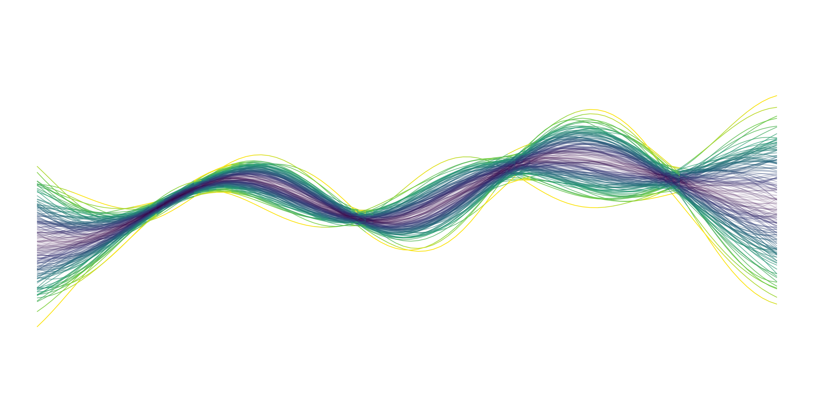

# Gaussian Processes



## Run
1. Clone Repo
2. Build Container
```
docker build --tag gp-docker:0.1 .
```

3. Run Container
```
docker run -t --rm -p 8888:8888 -v `pwd`/gp-tutorial:/tf/gp-tutorial --name gp gp-docker:0.1
```
## Overview
1. Introduction
2. Kernels
3. Application

